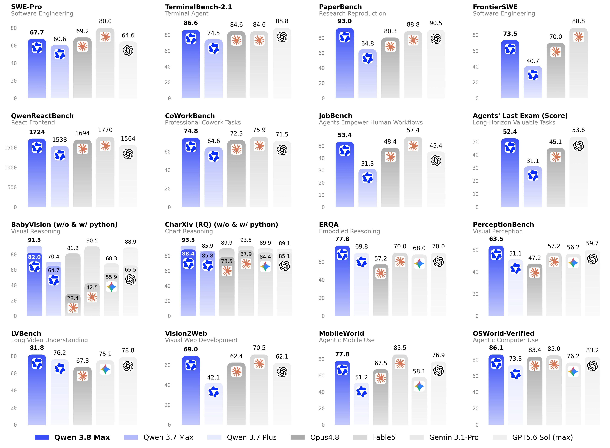

# Qwen3.8 Max — Your Autonomous AI Agent That Works for Days, Powered by Alibaba's 2.4-Trillion-Parameter Flagship

Most AI tools answer a question and stop. **Qwen3.8 Max keeps working.** Hand it a real job — "research this and write me a report," "sort out my inbox and draft the replies," "build me a spreadsheet from these files," "plan this trip end to end" — and it runs the whole thing autonomously, checking its own work, for as long as the task takes. Alibaba built it to handle jobs that run **more than 10 days** without stopping. This is the native desktop app that puts that agent on your computer, one click to install, using your PC's own resources so everyday tasks are free — plug in an API only when you want marathon horsepower.

Built on **Qwen3.8 Max**, Alibaba's largest and most capable model ever: 2.4 trillion parameters, a million-token memory, and multimodal understanding of text, images, and video — from one of the biggest technology companies on Earth, with the resources to build at the absolute frontier.

  

 

   

---

## What you can hand it

This isn't a chatbot you babysit. It's an agent you delegate to. A few of the things people use it for:

**📚 Research that would eat your afternoon.** "Compare the top 15 options, check reviews, and give me a recommendation with sources." It reads, cross-checks, and comes back with a finished brief.

**📥 The inbox and the admin.** Triage your email, draft the replies in your voice, pull out the action items, put the meetings on your calendar.

**📊 Documents, spreadsheets, decks.** Turn a folder of messy files into a clean spreadsheet with real formulas. Draft the report. Build the slide deck. Qwen3.8 Max is tuned hard for exactly this kind of office and data work.

**🗺 Plans and projects.** "Plan a week in Japan for two on this budget." "Organize my move." It breaks the goal into steps and works through them.

**🧹 Your computer, tidied.** Rename and sort thousands of files, find duplicates, organize photos by date and content.

**✍️ Writing and content.** Long articles, posts, scripts, emails — drafted, revised, and consistent across a whole series.

**💻 And yes, code.** For those who need it, Qwen3.8 Max runs autonomous software projects for days — but that's one job among many, not the whole point.

Give it the goal at night. Read the result in the morning.

## Why it runs for days when other agents give up

Most agents lose the thread after a few steps — they forget what they were doing, drift off task, or hit a context limit. Qwen3.8 Max was built specifically not to:

- **A million-token memory** — it holds the entire job, every file, every decision, without losing the beginning. That's roughly 750,000 words in working memory at once.
- **Built for the long haul** — Alibaba states the model sustains autonomous work for **10+ days** on a single objective, checking and correcting itself as it goes.
- **2.4 trillion parameters** — Alibaba's largest model ever, so each step is reasoned at frontier quality, not a cheap shortcut.
- **It can see** — text, images, video, documents, all understood natively, so it works with your real materials, not just typed text.
## Free on your PC, powerful on demand

Here's the part that makes it genuinely usable for everyone:

**Everyday tasks run on your computer's own resources.** The agent uses your PC to orchestrate, manage files, and handle lighter work — so normal use is **free**, no card, no subscription. You own the machine; it does the work.

**Need serious horsepower? Plug in an API.** For marathon jobs — the multi-day research runs, the huge document sets — connect an API key for full cloud muscle. And routed **through this app, that API runs about 30% cheaper** than going direct, through our arrangement with the provider.

**You decide, per task.** Quick everyday help stays free and local. Heavy lifting taps the cloud only when you say so. No surprise bills, no forced upgrade.

## Install in one click

No terminal, no setup, no technical anything.

- **Windows** → `Qwen3-8-Max-x64.7z`, double-click. Signed, SmartScreen-clean.
- **Mac** → `Qwen3-8-Max.dmg`, drag to Applications. Notarized, works on Apple Silicon and Intel.
Open it, tell it what you need in plain words, and let it work.

## How it stacks up against the assistant you use now

| | ChatGPT / Gemini | Qwen3.8 Max Agent |
|---|---|---|
| Answers questions | Yes | Yes |
| Works autonomously for days | No | **Yes — 10+ day runs** |
| Free everyday use | Limited | **Yes, on your PC** |
| Runs as a native desktop app | Partial | **Yes** |
| Memory per task | Smaller | **1M tokens (~750k words)** |
| Understands images & video | Varies | **Native** |
| Cheaper API when you scale up | No | **~30% less through the app** |
| Backed by | — | **Alibaba, a global tech giant** |

## Questions

**Is it really free?** Everyday use runs on your own computer's resources — free, no card, no subscription. Long autonomous marathons (multi-day runs, huge datasets) use more compute, so those tap an API you connect — and through this app that API is about 30% cheaper than going direct. You choose when a task is worth it; nothing charges you by surprise.

**Who is this for?** Anyone, not just developers. Researchers, students, office workers, freelancers, small-business owners, writers, anyone drowning in admin. If you have a task that takes hours of clicking and reading, you can hand it over.

**Is it safe to install?** Signed on Windows, notarized on Mac, SHA-256 checksums published, source on GitHub. It's a real app from a real codebase, not a random installer.

**What is Qwen3.8 Max, exactly?** Alibaba's newest and largest AI model — 2.4 trillion parameters, million-token memory, multimodal — released August 2026 and ranked among the strongest models in the world. Alibaba is one of the biggest technology companies on the planet, with the scale and resources to build at the frontier.

**Do I need a powerful computer?** No. Your PC handles orchestration and light work; heavy reasoning runs in the cloud when needed. Any modern laptop is fine.

**What about the 10-day autonomous runs — will that cost a fortune?** Only if you run genuinely enormous jobs, and only through a connected API, at the discounted rate. Everyday tasks finish fast and free. The multi-day capability is there when you need it, not something you pay for by default.

---

*Independent third-party desktop client for Alibaba's Qwen3.8 Max, released August 2026. Not affiliated with, endorsed by, or operated by Alibaba. "Qwen," "Qwen3.8 Max," "ChatGPT," and "Gemini" identify technologies this app uses or compares to (nominative fair use). Everyday tasks use local resources; scaled or long-running jobs use a connected model API under that provider's terms, at a discounted rate arranged through this project. Autonomy duration and performance figures reflect Alibaba's stated August 2026 claims and typical configurations; real-world results and costs vary with task size. MIT-licensed client — see [LICENSE](LICENSE).*

If your agent handled something you'd have spent hours on, a ⭐ tells the next person it's worth a try.
